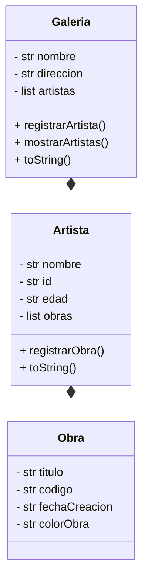

```mermaid
classDiagram
    Galeria *-- Artista
    Artista *-- Obra
    Galeria: - str nombre
    Galeria: - str direccion
    Galeria: - list<Artista> artistas
    Galeria: + registrarArtista()
    Galeria: + mostrarArtistas()
    Galeria: + toString()


    class Obra{
      - str titulo
      - str codigo
      - str fechaCreacion
      - str colorObra
    }
    class Artista{
      - str nombre
      - str id
      - str edad
      - list<Obra> obras

      + registrarObra() 
      + toString()
    }


```