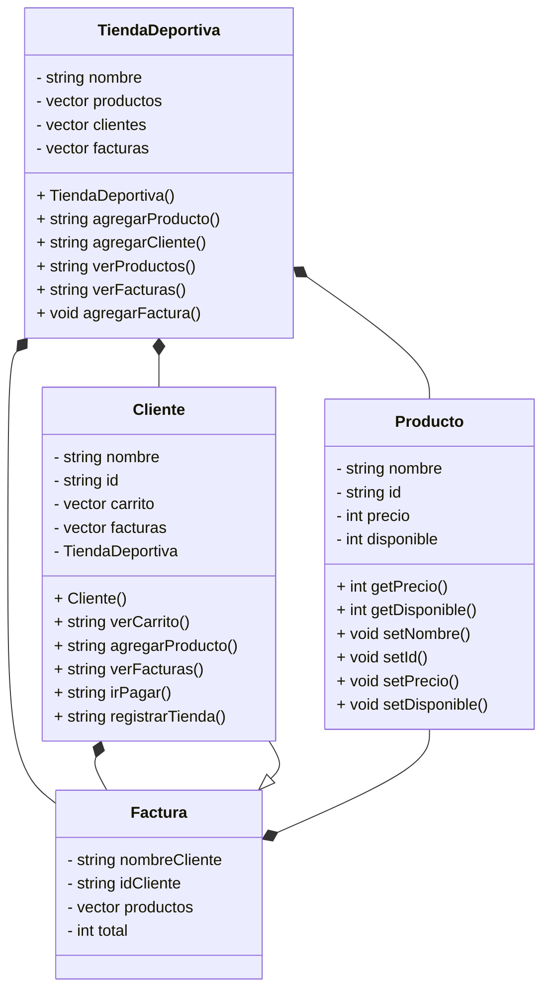

```mermaid
classDiagram
    class TiendaDeportiva {
        - string nombre
        - vector productos
        - vector clientes
        - vector facturas
        + TiendaDeportiva()
        + string agregarProducto()
        + string agregarCliente()
        + string verProductos()
        + string verFacturas()
        + void agregarFactura()
    }


    class Cliente {
        - string nombre
        - string id
        - vector carrito
        - vector facturas
        - TiendaDeportiva
        + Cliente()
        + string verCarrito()
        + string agregarProducto()
        + string verFacturas()
        + string irPagar()
        + string registrarTienda()
    }

    class Factura {

    - string nombreCliente
    - string idCliente
    - vector productos
    - int total

    }

    class Producto {
    - string nombre
    - string id
    - int precio
    - int disponible
    + int getPrecio()
    + int getDisponible()
    + void setNombre()
    + void setId()
    + void setPrecio()
    + void setDisponible()

    }


    TiendaDeportiva * --  Cliente
    TiendaDeportiva * --  Producto
    TiendaDeportiva * --  Factura
    Cliente * --  Factura
    Cliente  -- |> Factura
    Producto -- * Factura

```